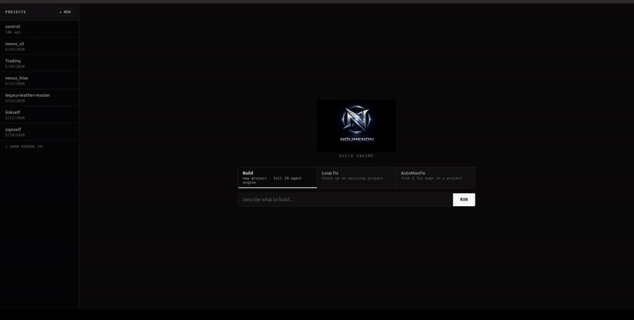

# AutoMaxFix

Audit → Reproduce → Patch → Test → Report



> Supported test runners: pytest · jest · vitest · mocha · go · cargo · generic

AutoMaxFix is a standalone open-source Python CLI for controlled repair loops in AI-built software. It turns failing tests, audit logs, or plain-English bug reports into structured tickets, then runs a safety-first patch workflow one ticket at a time.

**AutoMaxFix is not an autonomous code god.**
**AutoMaxFix is a controlled repair loop for AI-built software.**

The safety floor (enforced at infrastructure level, not in the prompt):

- Banned command list — `rm -rf`, `sudo`, `curl|bash`, `pip install`, `npm install` are all rejected before any agent sees them
- Path allowlist — patches cannot touch `.git/`, `.env*`, `secrets*`, or anything outside configured `allowed_paths`
- Dirty workspace check — won't run if there are uncommitted changes
- Reproduction test bundled in the same patch as the fix
- `max_files_changed` cap per patch

## Quick install

```bash
python3 -m venv .venv
.venv/bin/pip install -e .
.venv/bin/automaxfix --help
```

## CI Integration

Wire AutoMaxFix into GitHub Actions with the composite action in [docs/ci-integration.md](docs/ci-integration.md). The full walkthrough covers the reusable workflow wrapper, approval gating, path allowlists, and required permissions.

```yaml
- name: Run tests
  run: pytest -q 2>&1 | tee pytest-failures.log
- name: AutoMaxFix on failure
  if: failure()
  uses: ./.github/actions/automaxfix-action
  with:
    test-runner: pytest
    test-output-path: pytest-failures.log
    agent: codex_cli
    require-approval: true
    open-pr: true
```

### Watch Mode

For local failure loops, `automaxfix watch` polls a test command, captures each failing run, creates a ticket with the matching scanner, and launches `codex_cli` with `--max-attempts 2`.

```bash
automaxfix watch --test-runner pytest --command "pytest -q" --interval 30
```

Watch mode keeps the approval gate by default: it prints the full proposed diff and asks `y/n` before applying each patch attempt. To opt into unattended approval, set `watch_mode.auto_approve_in_watch: true` in config or export `AUTOMAXFIX_WATCH_AUTOAPPROVE=1`. The watched command is reused as the regression suite after each patch attempt, and polling continues until `Ctrl+C`.

## What AutoMaxFix Is

- A ticket generator for test runner failures and user bug reports
- A controlled patch-execution loop for local repositories
- A bridge between structured bug tickets and external coding agents such as Codex CLI or Claude CLI
- A local-first, open-source workflow with no required hosted API

## What It Is Not

- Not a blind repo rewriter
- Not a package installer
- Not a networked orchestration platform
- Not tied to Noumenon, Nexus, or any private internal stack

## Why AI-Built Software Needs Repair Loops

AI-generated code is fast, but speed creates failure modes:

- missing reproduction coverage
- low-confidence fixes
- patch sprawl across unrelated files
- hidden regressions after a "successful" edit

AutoMaxFix enforces a repair loop:

1. detect failure
2. create ticket
3. create or confirm a reproduction test
4. validate a patch
5. require human approval unless explicitly bypassed
6. apply only inside allowed paths
7. run targeted tests
8. run regression
9. generate a report
10. stop

## Install

Python 3.11+ is recommended.

If your environment does not provide a `python` alias, use `python3` for module mode:

```bash
python3 -m automaxfix.cli ...
```

Run directly:

```bash
python3 -m automaxfix.cli init
```

Or install a console script in a virtualenv:

```bash
pip install -e .
automaxfix init
```

## Quickstart

Initialize local state:

```bash
python3 -m automaxfix.cli init
```

Create a ticket from a bug report:

```bash
python3 -m automaxfix.cli bug "reminder gets duplicated after update"
```

Create tickets from pytest output:

```bash
python3 -m automaxfix.cli scan --pytest-output examples/broken_pytest_output.txt
```

Create tickets from other supported test runners:

```bash
python3 -m automaxfix.cli scan --jest-output tests/fixtures/jest/failures.txt
python3 -m automaxfix.cli scan --from-file test-output.log --format generic
```

Prepare a reproduction brief:

```bash
python3 -m automaxfix.cli reproduce --ticket .automaxfix/tickets/AMF-YYYYMMDD-001.json
```

Run Phase 3 in manual patch mode:

```bash
python3 -m automaxfix.cli run \
  --ticket .automaxfix/tickets/AMF-YYYYMMDD-001.json \
  --patch-file patch.diff \
  --yes
```

Read the latest report:

```bash
python3 -m automaxfix.cli report --latest
```

Check current status:

```bash
python3 -m automaxfix.cli status
```

Watch a local test loop:

```bash
python3 -m automaxfix.cli watch --test-runner pytest --command "pytest -q"
```

## CLI Usage

```bash
automaxfix init
automaxfix scan --pytest-output failed.txt
automaxfix scan --jest-output jest.log
automaxfix scan --vitest-output vitest.log
automaxfix scan --mocha-output mocha.log
automaxfix scan --go-output go-test.log
automaxfix scan --cargo-output cargo-test.log
automaxfix scan --from-file build.log --format generic
automaxfix bug "reminder gets duplicated after update"
automaxfix reproduce --ticket .automaxfix/tickets/AMF-YYYYMMDD-001.json
automaxfix run --ticket .automaxfix/tickets/AMF-YYYYMMDD-001.json --patch-file patch.diff
automaxfix run --ticket .automaxfix/tickets/AMF-YYYYMMDD-001.json --agent codex_cli
automaxfix run --ticket .automaxfix/tickets/AMF-YYYYMMDD-001.json --agent claude_cli
automaxfix run --ticket .automaxfix/tickets/AMF-YYYYMMDD-001.json --agent codex_cli --max-attempts 4
automaxfix watch --test-runner pytest --command "pytest -q"
automaxfix report --latest
automaxfix status
```

## Supported Test Runners

| Format | Flag | Example |
| --- | --- | --- |
| `pytest` | `--pytest-output <file>` | `automaxfix scan --pytest-output failed.txt` |
| `jest` | `--jest-output <file>` | `automaxfix scan --jest-output jest.log` |
| `vitest` | `--vitest-output <file>` | `automaxfix scan --vitest-output vitest.log` |
| `mocha` | `--mocha-output <file>` | `automaxfix scan --mocha-output mocha.log` |
| `go` | `--go-output <file>` | `automaxfix scan --go-output go-test.log` |
| `cargo` | `--cargo-output <file>` | `automaxfix scan --cargo-output cargo-test.log` |
| `generic` | `--from-file <file> --format generic` | `automaxfix scan --from-file build.log --format generic` |

Module mode is also supported:

```bash
python3 -m automaxfix.cli init
python3 -m automaxfix.cli bug "sample bug"
python3 -m automaxfix.cli run --ticket .automaxfix/tickets/AMF-YYYYMMDD-001.json --patch-file patch.diff
```

## Manual Patch Mode

Manual patch mode is the safest Phase 3 entrypoint.

1. Generate or hand-write a unified diff file.
2. Run `automaxfix run --ticket ... --patch-file patch.diff`.
3. AutoMaxFix validates the diff, checks the workspace, asks for approval unless `--yes`, applies the patch, runs tests, writes a report, and stops.

## Multi-attempt Repair

Agent-driven Phase 3 runs can now escalate through multiple repair strategies with:

```bash
automaxfix run --ticket .automaxfix/tickets/AMF-YYYYMMDD-001.json --agent codex_cli --max-attempts 3 --yes
```

Default behavior is 3 strategy attempts:

1. `minimal` -> smallest possible diff
2. `test_first` -> rewrite the failing test to state the expected behavior clearly, then fix the implementation
3. `refactor` -> allow a focused refactor when a tiny diff is not enough

If you raise `--max-attempts` to 4, the last fallback is `rollback`, which asks the agent to prefer reverting the suspected recent change first.

Each failed post-patch test attempt is written into the ticket's strategy memo with the strategy, reason, agent used, duration, and success flag. Re-running `automaxfix run` on the same ticket reuses that memo and skips strategies already exhausted.

The safety floor does not change between attempts: every strategy still goes through the same diff validation, approval, patch apply, targeted test, regression test, and report pipeline.

## Codex CLI Mode

Set the config:

```yaml
agent:
  mode: "codex_cli"
  command: "codex"
```

AutoMaxFix writes a temporary prompt file that includes the ticket JSON, repo rules, safety rules, required reproduction test, and expected output format. It then runs Codex CLI and accepts the result only if the output is a valid unified diff.

Phase 3 adds:

- a Codex-specific prompt preset
- invalid-diff retry feedback
- at most 2 retries for malformed diff output
- no retry when the output is unsafe rather than merely malformed

## Claude CLI Mode

Set the config:

```yaml
agent:
  mode: "claude_cli"
  command: "claude"
```

The Claude CLI path follows the same contract as Codex CLI:

- prompt file generated locally
- diff-only output expected
- strict patch validation before apply
- no auto-commit
- invalid-diff retry feedback with the same 2-retry cap

## Safety Rules

AutoMaxFix blocks:

- edits outside `repo_path`
- edits to `.git`, `.env`, `secrets`, `.venv`, `node_modules`, and other blocked paths
- package installs
- network or destructive shell patterns such as `rm -rf`, `sudo`, `curl | bash`, or `wget | bash`
- patches that touch too many files
- binary patches
- mode changes
- new source files when `allow_new_source_files: false`

Phase 3 patch apply requires a git repository.

## Patch Validation

Before apply, AutoMaxFix validates that the diff:

- is a unified diff
- stays inside allowed paths
- does not touch sensitive files
- does not exceed `max_files_changed`
- does not contain binary data
- does not sneak in dangerous shell payloads

If an external agent returns a malformed diff, AutoMaxFix may retry once or twice with stricter validation feedback. It does not retry failed tests automatically, and it does not retry unsafe patches that touch blocked paths or violate safety rules.

## Reproduction Requirement

By default, AutoMaxFix requires a real reproduction test before patching.

- If the ticket has a `reproduction_test`, AutoMaxFix runs it first and expects failure.
- If no reproduction test exists, AutoMaxFix stops safely and tells you to create one.
- `--no-repro` exists for explicit operator override, but the default path is reproduction-first.

## Ticket Lifecycle

Tickets are JSON files with this lifecycle:

- `new`
- `reproduced`
- `patched`
- `passed`
- `failed`

Each ticket tracks:

- source
- bug summary
- suspected files
- reproduction test path
- patch summary
- executed tests
- final result

## Rollback Instructions

Before apply, AutoMaxFix writes a pre-patch diff to `.automaxfix/reports/pre_patch_<ticket>.diff`.

After apply, the report tells you how to reverse the applied patch:

- `git apply -R .automaxfix/logs/applied_<ticket>.diff`
- if the workspace was already dirty, reapply the saved pre-patch diff as needed

## Why AutoMaxFix Stops After One Ticket

AutoMaxFix stops after every ticket because multi-ticket autonomy is where patch sprawl and hidden regressions start. The tool is intentionally narrow:

- one ticket
- one validated patch attempt
- one approval boundary
- one report

That makes failures debuggable and operator review realistic.

## Open-Source Roadmap

Current Phase 3:

- ticket creation
- reproduction briefs
- manual patch mode
- Codex CLI mode
- Claude CLI mode
- agent presets for cleaner diff output
- invalid-diff retry guardrails
- git-backed patch apply
- targeted and regression test execution
- phase-3 reports with rollback instructions

Next phase:

- Nexus Chaos Audit -> AutoMaxFix ticket importer
- patch scoring and retry workflows
